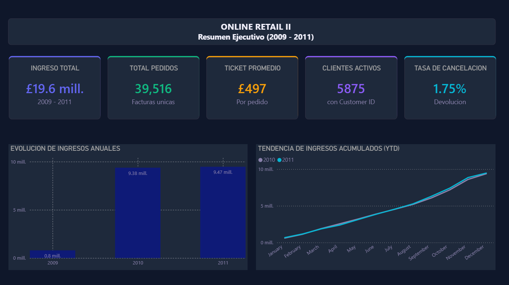
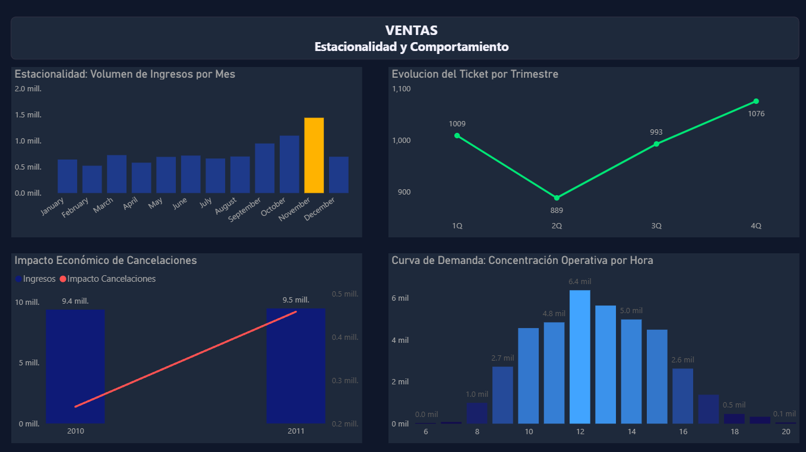
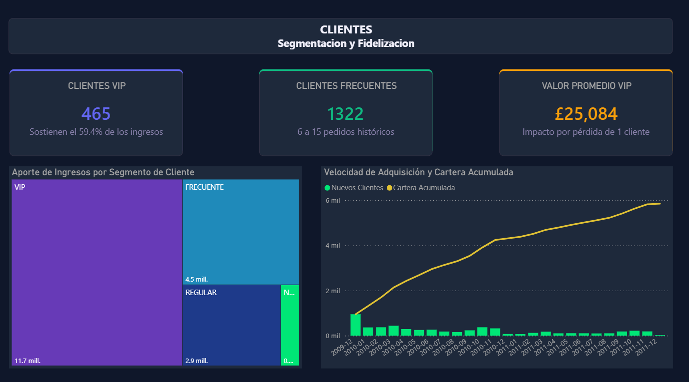
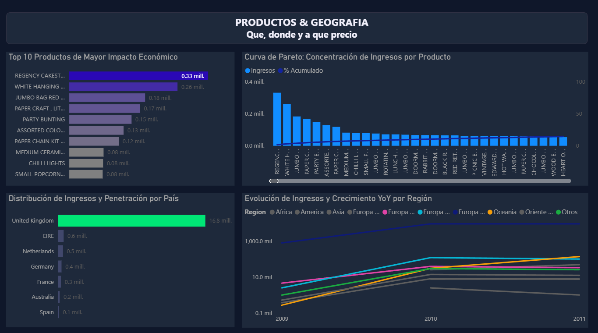

# Online Retail II — ETL + Data Warehouse + Power BI


Proyecto de Data Engineering y Analytics end-to-end sobre un dataset real de e-commerce con más de 1 millón de transacciones. Va desde la limpieza del CSV original hasta un Data Warehouse en SQL Server y un dashboard de 4 páginas en Power BI.

---

## Fuente de datos

| Campo | Detalle |
| :--- | :--- |
| **Dataset** | Online Retail II UCI |
| **Plataforma** | Kaggle ([Enlace al dataset](https://www.kaggle.com/datasets/mashlyn/online-retail-ii-uci)) |
| **Volumen original** | 1,067,371 filas · 8 columnas |
| **Volumen limpio** | 1,021,332 filas (46,039 eliminados en limpieza) |
| **Período** | Diciembre 2009 — Diciembre 2011 |
| **Origen** | Tienda de regalos online con sede en UK |

---

## Estructura del proyecto

```
Online-Retail-DW/
│
├── data/
│   └── online_retail_II.csv         # CSV original de Kaggle
│
├── notebooks/
│   └── ETL.ipynb                    # ETL completo: Extract, Transform, Load
│
├── sql/
│   └── OnlineRetail_consultas_analiticas.sql  # 20 consultas analíticas
│
├── assets/
│   ├── page1_resumen.png
│   ├── page2_ventas.png
│   ├── page3_clientes.png
│   └── page4_productos.png
│
├── powerbi/
│   └── dashboard.pbix
│
└── README.md
```

---

## Arquitectura — Esquema Estrella

El ETL transforma un único CSV plano en 5 tablas relacionadas en SQL Server:

| Tabla | Filas | Descripción |
| :--- | :--- | :--- |
| `fact_ventas` | 1,021,332 | Tabla central con métricas de venta |
| `dim_fecha` | 604 | Atributos temporales: año, mes, trimestre, día de semana |
| `dim_cliente` | 5,895 | Clientes con segmentación por frecuencia de compra |
| `dim_producto` | 4,924 | Productos con descripción y precio de referencia |
| `dim_geografia` | 43 | Países con región geográfica asignada |

---

## ETL — Problemas resueltos

El dataset original tiene varios problemas de calidad que el ETL resuelve antes de cargar al Data Warehouse:

| Problema | Cantidad | Solución aplicada |
| :--- | :--- | :--- |
| `Customer ID` nulos | 243,007 (22.77%) | Asignados como cliente `UNKNOWN` |
| Duplicados exactos | 34,335 | Eliminados con `drop_duplicates()` |
| Cantidades negativas | 22,950 | Excluidas — corresponden a devoluciones |
| Precios en cero | 6,202 | Excluidos de ventas normales |
| Códigos especiales (`POST`, `DOT`, `M`) | 5,985 | Excluidos — no son productos reales |
| Cancelaciones (`Invoice` empieza con `C`) | 19,494 | Conservadas con flag `is_cancelled = 1` |

La segmentación de clientes se construyó a partir de la frecuencia de compra histórica:

| Segmento | Criterio |
| :--- | :--- |
| UNKNOWN | Sin Customer ID en el dataset |
| NUEVO | 1 pedido |
| REGULAR | 2 a 5 pedidos |
| FRECUENTE | 6 a 15 pedidos |
| VIP | Más de 15 pedidos |

---

## Consultas analíticas — 20 queries

### Grupo 1 — KPIs Globales (01–04)

| # | Pregunta | Técnica SQL |
| :--- | :--- | :--- |
| 01 | ¿Cuál es el estado general del negocio? | Aggregation + NULLIF |
| 02 | ¿Cómo evolucionó el revenue año a año? | `LAG()` — crecimiento YoY |
| 03 | ¿Cuál es la tendencia mensual acumulada? | `SUM() OVER` — running total |
| 04 | ¿Los fines de semana venden más? | `DATEPART` + `CASE WHEN` |

### Grupo 2 — Análisis de Ventas (05–08)

| # | Pregunta | Técnica SQL |
| :--- | :--- | :--- |
| 05 | ¿Cuáles son los meses de mayor venta? | `RANK()` |
| 06 | ¿Cuál es el ticket promedio por trimestre? | CTE + `AVG` por factura |
| 07 | ¿Cuánto impactan económicamente las cancelaciones? | Agregación condicional |
| 08 | ¿A qué hora del día se generan más pedidos? | `DATEPART(HOUR)` + `% OVER` |

### Grupo 3 — Clientes y Segmentación (09–12)

| # | Pregunta | Técnica SQL |
| :--- | :--- | :--- |
| 09 | ¿Cuánto aporta cada segmento al revenue total? | `% OVER` particionado |
| 10 | ¿Quiénes son los top 10 clientes? | `ROW_NUMBER()` |
| 11 | ¿Cuántos clientes nuevos se captan cada mes? | `MIN(fecha)` + acumulado |
| 12 | ¿Qué porcentaje de clientes son recurrentes? | CTE + conteo condicional |

### Grupo 4 — Productos (13–16)

| # | Pregunta | Técnica SQL |
| :--- | :--- | :--- |
| 13 | ¿Cuáles son los top 10 productos por revenue? | `RANK()` doble |
| 14 | ¿Qué productos tienen mayor tasa de devolución? | Ratio cancelaciones / ventas |
| 15 | ¿Qué productos concentran el 80% del revenue? | Análisis de Pareto — acumulado |
| 16 | ¿El precio de venta real coincide con el de referencia? | JOIN `dim_producto` |

### Grupo 5 — Geografía y Tendencias (17–20)

| # | Pregunta | Técnica SQL |
| :--- | :--- | :--- |
| 17 | ¿Cuánto vende cada país y región? | `% OVER` global y por región |
| 18 | ¿Cuál es el top 3 de productos por país? | `ROW_NUMBER PARTITION BY` |
| 19 | ¿Cómo creció cada región año a año? | `LAG PARTITION BY` región |
| 20 | ¿Cuál es el perfil RFM de los clientes? | `NTILE(5)` + clasificación |

---

## Dashboard Power BI — 4 páginas

### 1 — Resumen Ejecutivo



£19.6M de ingresos totales en dos años, con 39,516 pedidos y un ticket promedio de £497. Lo que más llama la atención es que 2010 y 2011 son prácticamente iguales (£9.38M vs £9.47M), lo que indica un negocio estable con base de clientes consolidada más que en crecimiento activo. La tasa de cancelación de 1.75% es baja y saludable.

---

### 2 — Ventas y Estacionalidad



Noviembre es claramente el mes pico con casi £2M, impulsado por la temporada navideña — tiene sentido dado que el negocio vende artículos de regalo. El ticket promedio cae en Q2 (£889) y se recupera fuerte en Q4 (£1,076), lo que refuerza la estacionalidad. La concentración operativa entre las 10am y 3pm y la ausencia de actividad los fines de semana confirma que la clientela es principalmente B2B.

---

### 3 — Clientes y Segmentación



465 clientes VIP sostienen el 59.4% de los ingresos totales — perder un solo cliente VIP representa en promedio £25,084 de impacto. La cartera acumulada creció de forma acelerada durante 2009-2010 y se estabilizó en 2011, señal de que el negocio llegó a su capacidad natural de captación. El treemap deja claro visualmente que el segmento VIP domina de forma absoluta sobre el resto.

---

### 4 — Productos y Geografía



REGENCY CAKESTAND lidera con £330K de ingresos. La curva de Pareto confirma que un grupo pequeño de productos genera la mayoría del revenue — los primeros 5 productos concentran una proporción desproporcionada del total. UK domina con £16.8M (85.5% del revenue global), y la brecha con el segundo mercado (EIRE con £0.6M) es enorme, lo que indica una dependencia alta en un solo mercado. El gráfico de regiones usa escala logarítmica para poder visualizar la diferencia entre Europa Occidental y el resto de las regiones.

---

## Cómo reproducir el proyecto

1. Clona el repositorio: `git clone https://github.com/aroman2727/Online-Retail-DW`
2. Descarga el CSV desde [Kaggle](https://www.kaggle.com/datasets/mashlyn/online-retail-ii-uci) y colócalo en la carpeta `data/`
3. Crea la base de datos en SSMS: `CREATE DATABASE OnlineRetail_DW`
4. Abre `ETL.ipynb` en Jupyter o VS Code, ajusta la ruta del CSV y ejecuta celda por celda
5. Abre `OnlineRetail_consultas_analiticas.sql` en SSMS para explorar los análisis
6. Conecta Power BI: Obtener datos → SQL Server → `OnlineRetail_DW` → pega cada consulta como fuente independiente

---

## Autor

**Aaron Alejandro Kiwaki Alvarez**
Ingeniero Mecatrónico con 5 años en telecomunicaciones, en transición hacia roles de Data Analytics y Business Intelligence.

- LinkedIn: [aaron-kiwaki](https://www.linkedin.com/in/aaron-kiwaki/)
- GitHub: [aroman2727](https://github.com/aroman2727)
- Email: alejandro.kiwaki@gmail.com

---

*Dataset utilizado bajo los términos de uso de Kaggle.*

---

*Dataset utilizado bajo los términos de uso de Kaggle.*
